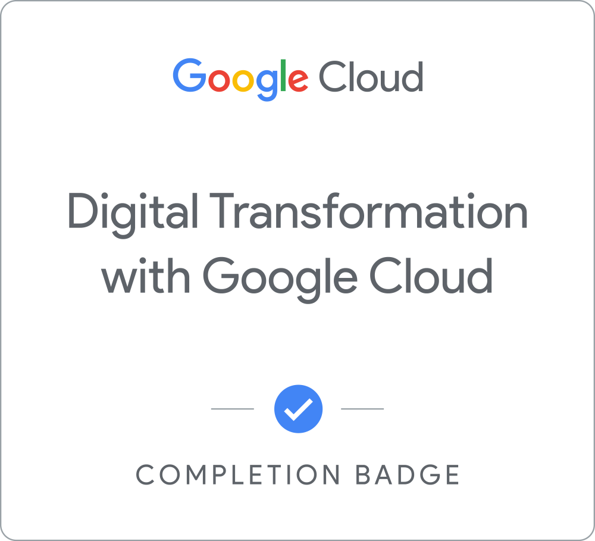
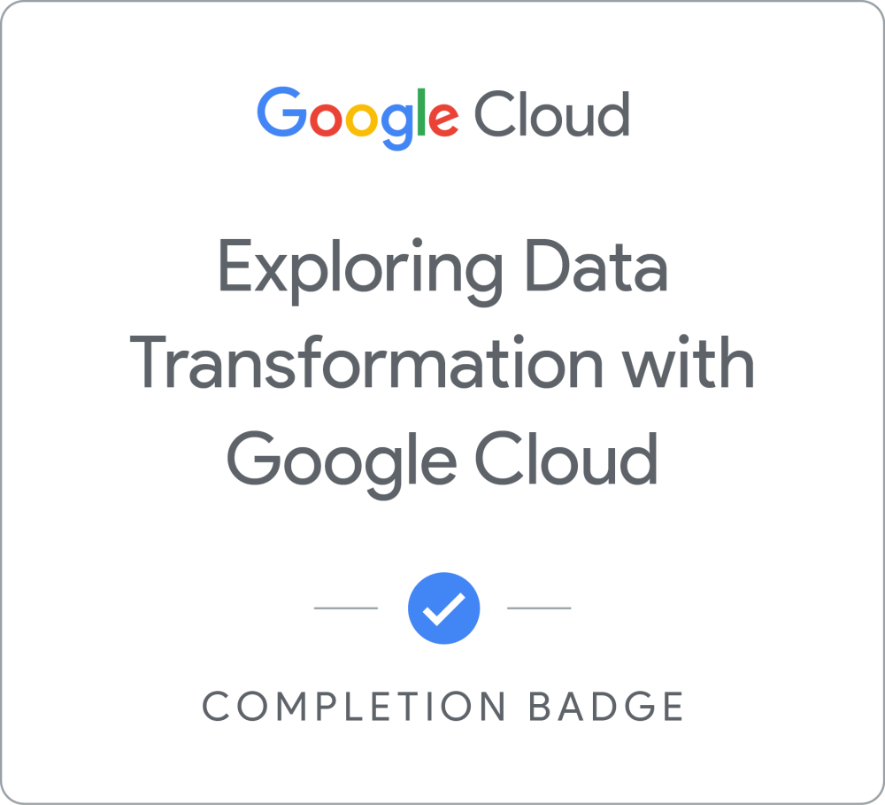

# 🧠 Cloud Portfolio – GCP Focused

Welcome to my cloud learning journey!  
This repo documents my hands-on labs, certifications, and project work as I pursue Google Cloud certification (ACE and PCA) and target remote cloud/data roles globally.

## 🎯 Current Focus
- Certs: ACE, PCA (Google Cloud)  
- Projects: Serverless ETL pipelines, cost-optimized analytics, IaC deployments  
- Target Roles: Remote Cloud Data Engineer, Analytics Specialist, GCP Solutions Architect

## 🧩 Certifications
| # | Course | Badge | Notes |
|---|--------|-------|-------|
| 01 | Digital Transformation with Google Cloud |  | [Summary & Notes](certifications/01-digital-transformation-intro/summary.md) |
| 02 | Exploring Data Transformation with Google Cloud |  | [Summary & Notes](certifications/02-exploring-data-transformation/summary.md) |

## 🚀 Upcoming Projects
- [ ] Serverless thumbnailer (Cloud Functions + GCS)
- [ ] PCA Labs – IAM, Compute, Storage chaos-mastery
- [ ] Cost-aware BigQuery pipeline using Terraform

---

📬 Let’s Connect
[LinkedIn](https://linkedin.com/in/akshay101)